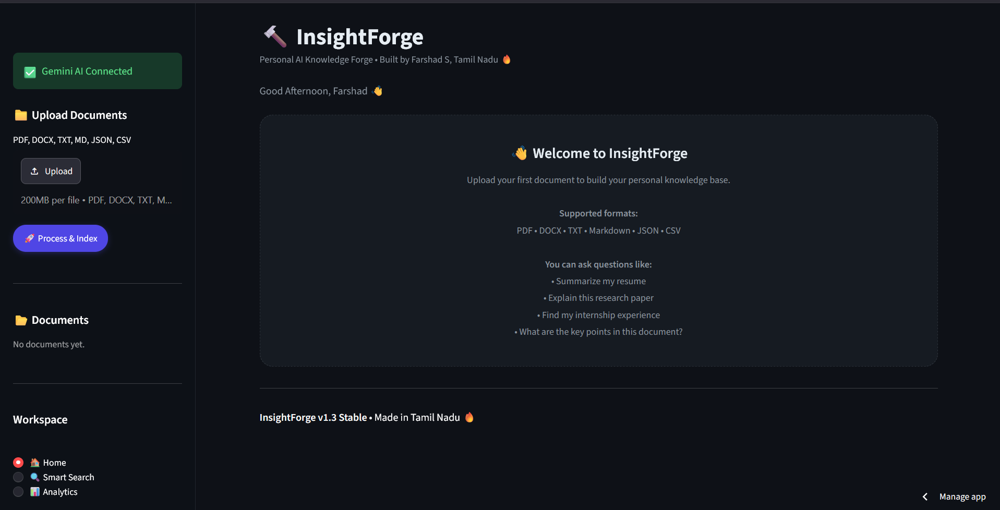
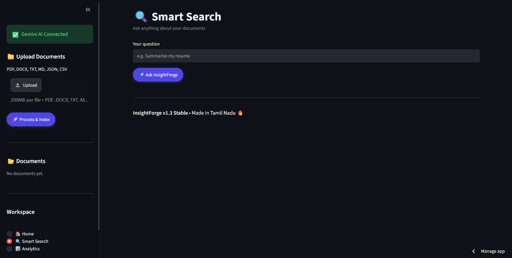
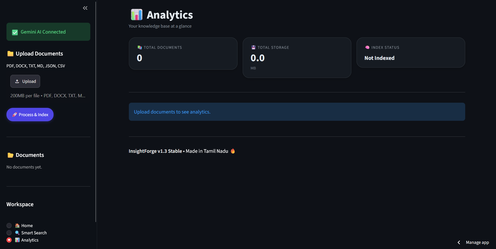

# 🔨 InsightForge

> **Personal AI Knowledge Forge** — upload your documents, search them semantically, and ask questions using Retrieval-Augmented Generation (RAG) with Google Gemini.

## 🌐 Live Demo

🚀 **[Launch InsightForge](https://insightforgefd.streamlit.app)**

## ✨ Features

- 📄 Upload PDF, DOCX, TXT, Markdown, JSON, and CSV files
- 🧠 Semantic search using FAISS + Sentence Transformers
- 🤖 AI-powered Q&A using Google Gemini
- 💬 Conversation-based chat interface
- 🔍 Search history
- 📊 Analytics dashboard with document and file-type statistics
- 📂 Document Manager with deletion and automatic re-indexing
- 📑 Source citations for retrieved document chunks
- ⬇️ Export answers as TXT or Markdown
- 🎨 Material-inspired dark user interface
- 🔐 Secure API key management using environment variables and Streamlit Secrets

## 📸 Screenshots

### 🏠 Dashboard



### 💬 RAG Chat



### 📊 Analytics



## 🧠 How It Works

InsightForge uses a Retrieval-Augmented Generation (RAG) pipeline to answer questions from uploaded documents.

```text
User uploads document
        ↓
Document extraction
        ↓
Text chunking
        ↓
Sentence Transformer embeddings
        ↓
FAISS vector store
        ↓
User asks a question
        ↓
Semantic similarity search
        ↓
Relevant document chunks
        ↓
Google Gemini
        ↓
AI-generated answer
        ↓
Source citations